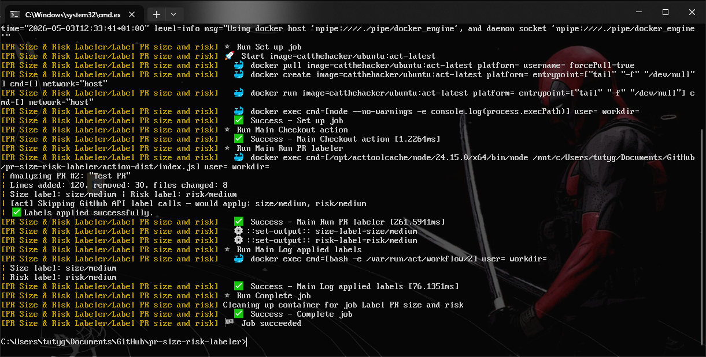

# 🏷️ PR Size & Risk Labeler

* A GitHub Action that automatically labels pull requests based on diff size and change risk.
* Code is **NOT** published to `GitHub Marketplace` yet!!! I will at some point.
> ⚠️ **Not published yet.** This action is in development and not available on the GitHub Marketplace yet. Do not publish or redistribute without permission.


## ⚡ What it does

When a pull request is opened or updated, the action:

* Calculates total lines changed (additions + deletions)
* Assigns a size label:
  - `size/small` — fewer than `100` lines
  - `size/medium` — `100` to `499` lines
  - `size/large` — `500+` lines
* Assigns a risk label:
  - `risk/low` — small change across few files
  - `risk/medium` — moderate change
  - `risk/high` — large or wide-file change

All thresholds are configurable via action inputs.

## How to use once published

> 💡 See `label-pr-example.yml` for a full workflow example.

## 🚀 Usage

```yaml
- name: Run PR labeler
  uses: your-org/pr-size-risk-labeler@v1
  with:
    github-token: ${{ secrets.GITHUB_TOKEN }}
    enable-risk-labels: 'true'
    size-small-threshold: '99'
    size-medium-threshold: '499'
    risk-low-lines: '99'
    risk-low-files: '5'
    risk-medium-lines: '499'
    risk-medium-files: '15'
```

## 📥 Inputs

| Input | Required | Default | Description |
|---|---|---|---|
| `github-token` | yes | `github.token` | Token with pull-request and issues write permissions |
| `enable-risk-labels` | no | `true` | Set to `false` to skip risk labels |
| `size-small-threshold` | no | `99` | Lines `≤ 99` -> `size/small` |
| `size-medium-threshold` | no | `499` | Lines `≤ 499` -> `size/medium`, above -> `size/large` |
| `risk-low-lines` | no | `99` | Lines threshold for `risk/low` (both conditions must hold) |
| `risk-low-files` | no | `5` | Files threshold for `risk/low` (both conditions must hold) |
| `risk-medium-lines` | no | `499` | Lines threshold for `risk/medium` (both conditions must hold), above -> `risk/high` |
| `risk-medium-files` | no | `15` | Files threshold for `risk/medium` (both conditions must hold), above -> `risk/high` |

---

## 📤 Outputs

| Output | Description |
|---|---|
| `size-label` | The size label applied — one of `size/small`, `size/medium`, `size/large` |
| `risk-label` | The risk label applied — one of `risk/low`, `risk/medium`, `risk/high`, or empty string if disabled |


## 🛠️ Development

### Install dependencies

```bash
npm install
```

### Build

```bash
npm run build
```

The output is written to `action-dist/index.js`.

### Format with Prettier

```bash
npm run format
```

## Testing locally with nektos/act 🐳

### 1. Install act

```powershell
winget install nektos.act
```

### 2. Build the action

```bash
npm run build
```

### 3. 🔑 Create a personal access token

Go to `GitHub Settings` → `Developer settings` → `Personal access tokens` → `Tokens (classic)`and create a token with `repo` scope.

### 4. Run against the mock event

> ⚠️ You need Docker installed and running.

Bash:

```bash
act pull_request --eventpath events/pull_request.json --workflows label-pr-example.yml --secret GITHUB_TOKEN=your_pat_here --platform ubuntu-latest=catthehacker/ubuntu:act-latest --verbose --bind
```

PowerShell:

```powershell
act pull_request --eventpath events/pull_request.json --workflows label-pr-example.yml --secret GITHUB_TOKEN=your_pat_here --platform ubuntu-latest=catthehacker/ubuntu:act-latest --verbose --bind
```

> 💡 On first run select **Medium** when prompted for the Docker image size. It shouldn't usually ask but be aware.

### 5. ♻️ Rebuild and retest (Run this after building the image above)

```bash
npm run build && act pull_request --eventpath events/pull_request.json --workflows label-pr-example.yml --secret GITHUB_TOKEN=your_pat --bind
```

* You should see something like in the image below.



> ✅ With `120+30=150` lines and `8` files the action should strip all existing labels and resolve down to just `size/medium` and `risk/medium`. This comes from the `events/pull_request.json` mock.

## 📁 Project structure

```
├── src/
│   ├── main.ts
│   ├── analyzer.ts
│   ├── labeler.ts
│   └── config.ts
├── events/
│   └── pull_request.json
├── action.yml
├── label-pr-example.yml
├── tsconfig.json
├── package.json
├── package-lock.json
├── .prettierrc
└── .prettierignore
```